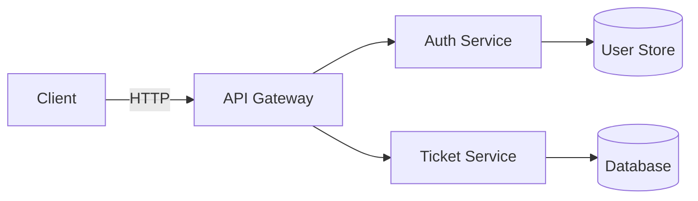

# Design Document — [Feature Name]

<!-- 
  PURPOSE: This document specifies HOW the system will be built to satisfy the requirements.
  It includes architecture, component design, data models, correctness properties, error handling,
  and testing strategy.
  
  WHEN TO USE THIS TEMPLATE:
  - Creating a design for a feature (requirements-first workflow)
  - Starting with design before requirements (design-first workflow)
  - Documenting the fix approach for a bug (bugfix workflow)
  
  WORKFLOW GUIDANCE:
  - Requirements-First: Write this AFTER requirements.md is approved
  - Design-First: Write this FIRST, then derive requirements.md
  - Bugfix: Write this AFTER defining the bug condition and reproduction test
-->

## Overview

<!-- 
  WHAT TO WRITE HERE:
  - High-level description of what this system/feature does (2-4 paragraphs)
  - Primary goals and success criteria
  - Explicit scope boundaries (what IS and IS NOT included)
  - Key constraints (technology, performance, security)
  
  EXAMPLE:
  "The Support Ticket Management System is a full-stack web application for creating, 
  tracking, and managing support tickets. The backend is a Spring Boot 3 REST API backed 
  by PostgreSQL (H2 for tests), schema-managed with Flyway. The frontend is a React / Next.js 
  single-page app that communicates exclusively through the REST API."
-->

[Describe the system at a high level. What is being built and why?]

### Goals

<!-- List 3-7 specific, measurable goals for this design -->

- [Goal 1: e.g., Provide reliable CRUD lifecycle for tickets]
- [Goal 2: e.g., Enforce predictable state machine with clear rejection semantics]
- [Goal 3: e.g., Support keyword search and filtering]

### Scope

<!-- Clearly state what IS and IS NOT included in this design -->

This design covers:
- [What is included, e.g., REST API endpoints for ticket management]
- [What is included, e.g., Database schema and persistence layer]
- [What is included, e.g., Frontend components for ticket display]

This design does NOT cover:
- [What is explicitly excluded, e.g., User authentication (v1)]
- [What is explicitly excluded, e.g., Email notification system]
- [What is explicitly excluded, e.g., Mobile app implementation]

---

## Architecture

<!-- 
  WHAT TO WRITE HERE:
  - System structure and layer organization
  - Component interaction patterns
  - Technology stack and key libraries
  - Deployment architecture (if relevant)
  - ASCII art or Mermaid diagrams to visualize structure
  
  USE DIAGRAMS: ASCII art for simple flows, Mermaid for complex diagrams
  
  EXAMPLE STRUCTURES:
  - Three-tier: UI → API → Database
  - Microservices: Service mesh with API gateway
  - Event-driven: Producers → Message queue → Consumers
  - Monolithic: Layered controller → service → repository
-->

The system follows a [architectural pattern name, e.g., "layered, three-tier architecture"]:

```
┌─────────────────────────────────────────┐
│          [Frontend Layer]               │  [Technology]
└────────────────┬────────────────────────┘
                 │  [Protocol, e.g., HTTP / JSON]
┌────────────────▼────────────────────────┐
│         [Backend Layer]                  │  [Technology]
│  ┌──────────┐  ┌──────────┐  ┌────────┐ │
│  │Component1│  │Component2│  │Component3│ │
│  └──────────┘  └──────────┘  └───┬────┘ │
└───────────────────────────────────┼──────┘
                                    │  [Protocol, e.g., JDBC]
           ┌────────────────────────▼──────┐
           │  [Data Layer, e.g., PostgreSQL] │
           └─────────────────────────────────┘
```

<!-- ALTERNATIVE: Mermaid diagram for more complex architectures -->



### Layer responsibilities

<!-- Define what each architectural layer or component is responsible for -->

| Layer | Responsibility |
|---|---|
| [Layer/Component 1] | [What it does, e.g., Parse HTTP requests, delegate to Service] |
| [Layer/Component 2] | [What it does, e.g., Business logic, validation, orchestration] |
| [Layer/Component 3] | [What it does, e.g., Data access via ORM/repository pattern] |
| [Layer/Component 4] | [What it does, e.g., Persistence, schema management] |

### Key design decisions

<!-- Document important architectural choices and rationale -->

- **[Decision 1, e.g., Separate status-transition endpoint]** — [Rationale: keeps field-update concerns distinct from lifecycle concerns]
- **[Decision 2, e.g., Single global exception handler]** — [Rationale: ensures consistent JSON error responses across all endpoints]
- **[Decision 3, e.g., Spring profiles for datasource]** — [Rationale: H2 for tests, PostgreSQL for prod, no credentials in code]

---

## Components and Interfaces

<!-- 
  WHAT TO WRITE HERE:
  - REST API endpoints with HTTP methods, paths, status codes
  - Component/class/module structure
  - Interface definitions and contracts
  - Request/response payload examples
  - Integration points with external systems
  
  FOR REST APIs: Document all endpoints in a table
  FOR LIBRARIES/MODULES: Show the package/module structure
  FOR MICROSERVICES: Document service boundaries and communication protocols
-->

### REST Endpoints

<!-- USE THIS SECTION for REST APIs - document all endpoints -->

#### [Resource Name, e.g., Tickets]

| Method | Path | Description | Success | Error Codes |
|---|---|---|---|---|
| `POST` | `/api/[resource]` | [Create resource] | 201 | 400, 422 |
| `GET` | `/api/[resource]` | [List all resources with optional filters] | 200 | - |
| `GET` | `/api/[resource]/{id}` | [Get resource detail] | 200 | 404 |
| `PATCH` | `/api/[resource]/{id}` | [Update resource fields] | 200 | 400, 404, 422 |
| `DELETE` | `/api/[resource]/{id}` | [Delete resource] | 204 | 404 |

<!-- Add more resource tables as needed -->

#### [Another Resource, e.g., Comments]

| Method | Path | Description | Success | Error Codes |
|---|---|---|---|---|
| `POST` | `/api/[parent]/{id}/[resource]` | [Create nested resource] | 201 | 400, 404 |

#### Query Parameters

<!-- Document search, filter, pagination query parameters -->

- `?status=[value]` — Filter by status (exact match)
- `?q=[keyword]` — Search by keyword (case-insensitive, searches title and description)
- `?page=[number]&size=[number]` — Pagination parameters
- Multiple filters can be combined (AND logic)

---

### Request / Response Shapes

<!-- 
  Show JSON examples for all request and response bodies
  Use realistic field names and example values
-->

**[Operation Name] — Request**
```json
{
  "field1": "example value",
  "field2": "example value",
  "field3": "ENUM_VALUE"
}
```

**[Resource] — Response (list item)**
```json
{
  "id": 1,
  "field1": "example value",
  "field2": "ENUM_VALUE",
  "createdAt": "2024-06-01T10:00:00Z"
}
```

**[Resource] — Response (detail)**
```json
{
  "id": 1,
  "field1": "example value",
  "field2": "example value",
  "field3": "ENUM_VALUE",
  "createdAt": "2024-06-01T10:00:00Z",
  "updatedAt": "2024-06-01T10:00:00Z",
  "relatedResources": [
    {
      "id": 1,
      "field": "value",
      "createdAt": "2024-06-01T11:00:00Z"
    }
  ]
}
```

**Error Response**
```json
{
  "status": 422,
  "message": "Human-readable error description",
  "errors": []
}
```

**Validation Error Response**
```json
{
  "status": 400,
  "message": "Validation failed",
  "errors": [
    { "field": "fieldName", "message": "must not be blank" },
    { "field": "anotherField", "message": "must be between 1 and 255 characters" }
  ]
}
```

---

### Component Map

<!-- 
  BACKEND COMPONENT STRUCTURE
  Show the package/module organization for backend code
  Use a tree structure to show hierarchy
-->

```
[root package, e.g., com.example.feature]
├── controller
│   ├── [Resource]Controller      # [Description, e.g., CRUD + status transition]
│   └── [Another]Controller       # [Description]
├── service
│   ├── [Resource]Service         # [Description, e.g., Business logic, orchestration]
│   ├── [Another]Service          # [Description]
│   └── [Business Logic Component] # [Description, e.g., State machine, validator]
├── repository
│   ├── [Resource]Repository      # [Description, e.g., Spring Data JPA, database access]
│   └── [Another]Repository       # [Description]
├── model
│   ├── [Entity1]                 # [Description, e.g., JPA entity]
│   ├── [Entity2]                 # [Description]
│   ├── [EnumType1]               # [Description, e.g., Enum: VALUE1, VALUE2, VALUE3]
│   └── [EnumType2]               # [Description]
├── dto
│   ├── Create[Resource]Request
│   ├── Update[Resource]Request
│   ├── [Resource]Response
│   └── ErrorResponse
├── exception
│   ├── [Custom]Exception         # [When thrown, e.g., when resource not found]
│   ├── [Another]Exception        # [When thrown]
│   └── GlobalExceptionHandler    # [Description, e.g., @RestControllerAdvice, maps exceptions to HTTP responses]
└── config
    └── [Config]Config            # [Description, e.g., Security, database, external service config]
```

---

### State Machine (If Applicable)

<!-- 
  USE THIS SECTION if your design includes state transitions
  Document all valid states and allowed transitions
  Show which transitions are allowed and which are rejected
-->

The `[Component Name, e.g., TicketStateMachine]` component encodes the allowed transitions and rejects invalid transitions with [error handling, e.g., HTTP 422].

```
[STATE1] ──────► [STATE2] ──► [STATE3] ──► [STATE4]
  │                  │
  └──► [STATE5] ◄───┘
```

Allowed transitions table:

| From | To | Condition (if any) |
|---|---|---|
| [STATE1] | [STATE2] | [Condition or "Always allowed"] |
| [STATE1] | [STATE5] | [Condition or "Always allowed"] |
| [STATE2] | [STATE3] | [Condition or "Always allowed"] |
| [STATE2] | [STATE5] | [Condition or "Always allowed"] |
| [STATE3] | [STATE4] | [Condition or "Always allowed"] |

All other transitions are rejected with [error response, e.g., HTTP 422 and InvalidStateTransitionException].

---

### Frontend Component Map (If Applicable)

<!-- 
  USE THIS SECTION for frontend/UI designs
  Show page/screen structure and reusable components
-->

```
pages/
  [page-name].tsx               # [Description, e.g., List page with filters]
  [resource]/[id].tsx           # [Description, e.g., Detail page]

components/
  [Component1].tsx              # [Description, e.g., Tabular display with sort]
  [Component2].tsx              # [Description, e.g., Card layout]
  [Form].tsx                    # [Description, e.g., Modal for creation]
  [Display].tsx                 # [Description, e.g., Chronological display]
  [Input].tsx                   # [Description, e.g., Search input]
  [Filter].tsx                  # [Description, e.g., Dropdown filter]
  ErrorNotification.tsx         # Displays API error messages

lib/
  api.ts                        # Typed API client (fetch wrappers)
  types.ts                      # Shared TypeScript types
  utils.ts                      # Helper functions
```

---

## Data Models

<!-- 
  WHAT TO WRITE HERE:
  - Database tables/collections with columns/fields
  - Data types and constraints
  - Relationships (foreign keys, references)
  - Indexes for performance
  - Migration/schema management approach
  
  FOR SQL DATABASES: Show CREATE TABLE structure
  FOR NoSQL: Show document schema with field types
  FOR GRAPH DATABASES: Show node/edge schema
-->

### Entity: [Entity Name, e.g., Ticket]

| Column | Type | Constraints | Description |
|---|---|---|---|
| `id` | `BIGINT` | PK, generated | Unique identifier |
| `field1` | `VARCHAR(255)` | NOT NULL | [Description] |
| `field2` | `TEXT` | NOT NULL | [Description] |
| `field3` | `VARCHAR(20)` | NOT NULL, default `'VALUE'` | [Description, e.g., Enum field] |
| `created_at` | `TIMESTAMP WITH TIME ZONE` | NOT NULL, default now() | Creation timestamp |
| `updated_at` | `TIMESTAMP WITH TIME ZONE` | NOT NULL, default now() | Last update timestamp |

### Entity: [Related Entity, e.g., Comment]

| Column | Type | Constraints | Description |
|---|---|---|---|
| `id` | `BIGINT` | PK, generated | Unique identifier |
| `parent_id` | `BIGINT` | FK → [parent_table](id), NOT NULL | Reference to parent entity |
| `field1` | `VARCHAR(255)` | NOT NULL | [Description] |
| `field2` | `TEXT` | NOT NULL | [Description] |
| `created_at` | `TIMESTAMP WITH TIME ZONE` | NOT NULL, default now() | Creation timestamp |

### Relationships

<!-- Document entity relationships explicitly -->

- **[Entity1] to [Entity2]**: One-to-Many (one [Entity1] has many [Entity2]s)
- **[Entity3] to [Entity4]**: Many-to-Many (junction table: `[entity3]_[entity4]`)

### Indexes

<!-- Document all indexes for query performance -->

- `[table]([column])` — Supports [query type, e.g., status filter queries]
- `[table]([column] DESC)` — Supports [query type, e.g., default ordering by creation time]
- `[table]([column1], [column2])` — Composite index for [query type, e.g., filtering by status and searching by keyword]

**Performance considerations:**
- Full-text search on `[field]` uses [approach, e.g., LOWER(field) LIKE LOWER(:keyword) or PostgreSQL ILIKE]
- Future optimization: [e.g., GIN index on tsvector column for full-text search at scale]

### Schema Management

<!-- Document how database schema changes are managed -->

**Approach**: [Tool name, e.g., Flyway, Liquibase, Django migrations, Alembic]

**Migration files location**:
```
[path, e.g., src/main/resources/db/migration/]
  V1__[description].sql
  V2__[description].sql
```

**Example migration** (V1__create_[table]_table.sql):
```sql
CREATE TABLE [table_name] (
  id BIGSERIAL PRIMARY KEY,
  field1 VARCHAR(255) NOT NULL,
  field2 TEXT NOT NULL,
  created_at TIMESTAMP WITH TIME ZONE NOT NULL DEFAULT NOW()
);

CREATE INDEX idx_[table]_[field] ON [table_name]([field]);
```

---

## Correctness Properties

<!-- 
  ⚠️ CRITICAL SECTION - READ BEFORE WRITING ⚠️
  
  WHAT ARE CORRECTNESS PROPERTIES?
  A correctness property is a universal characteristic that must hold across ALL valid 
  executions of a system component. Properties are expressed as "for all X, condition P(X) 
  holds" statements.
  
  WHEN TO INCLUDE THIS SECTION:
  ✅ Use Property-Based Testing when:
     - Code has clear input/output behavior (pure functions, deterministic transformations)
     - Universal properties hold across a wide input space
     - Input space is large or infinite (strings, numbers, collections, structured data)
     - Testing parsers, serializers, data transformations, algorithms, business logic
  
  ❌ DO NOT use Property-Based Testing for:
     - Infrastructure as Code (Terraform, CDK, CloudFormation) → Use snapshot tests
     - UI rendering and layout (React components, HTML) → Use visual regression tests
     - Simple CRUD operations (direct DB reads/writes) → Use example-based unit tests
     - Configuration validation → Use schema validation
     - Side-effect-only operations (emails, logging) → Use mock-based tests
     - External service integration without logic → Use integration tests with 1-3 examples
  
  PROPERTY CREATION PROCESS (Requirements-First Workflow):
  1. Complete acceptance criteria in requirements.md
  2. Write design sections through Data Models
  3. **ASSESS PBT APPLICABILITY** (see criteria above)
  4. **IF PBT APPLIES**:
     a. STOP before writing this section
     b. RUN PREWORK TOOL to analyze each acceptance criterion
     c. CLASSIFY each: PROPERTY | EXAMPLE | EDGE_CASE | INTEGRATION | SMOKE
     d. PERFORM PROPERTY REFLECTION to eliminate redundancy
     e. WRITE properties based on prework analysis
  5. **IF PBT DOES NOT APPLY**:
     - SKIP this section entirely
     - Document alternative testing strategy in "Testing Strategy" section
  6. Complete remaining sections (Error Handling, Testing Strategy)
  
  PROPERTY ANNOTATION FORMAT:
  Each property MUST follow this exact format:
  
  ### Property N: [Clear, Descriptive Title]
  
  *For any/all* [universal quantification starting with "for any" or "for all"]
  
  **Validates: Requirements X.Y, X.Z**
  
  COMMON PROPERTY PATTERNS:
  See examples below for each pattern type
-->

<!-- 
  IF PROPERTY-BASED TESTING IS NOT APPLICABLE:
  Delete this entire "Correctness Properties" section and document your alternative 
  testing approach in the "Testing Strategy" section below.
-->

*Correctness properties are universal characteristics that must hold across all valid executions of system components. Each property is validated through property-based tests that run a minimum of 100 randomly generated test cases.*

---

### Property 1: [Invariant Name, e.g., Resource Creation Invariants]

<!-- PATTERN: Invariants - Properties that remain constant despite transformations -->
<!-- EXAMPLE: "For any valid creation request, the created resource has required fields populated" -->

*For any* [universal quantification, e.g., valid creation request with fields X, Y, Z], the created [resource] SHALL have [invariant conditions, e.g., status = DEFAULT_VALUE, non-null id, non-null timestamp].

**Validates: Requirements [X.Y, X.Z]**

---

### Property 2: [Round-Trip Name, e.g., Serialization Round-Trip]

<!-- PATTERN: Round-Trip - Operation followed by inverse returns to original value -->
<!-- EXAMPLE: "For any valid object, serialize then deserialize produces equivalent object" -->
<!-- CRITICAL: Always include round-trip property for parsers and serializers -->

*For any* [input type, e.g., valid Comment object], [operation, e.g., serializing to JSON] followed by [inverse operation, e.g., deserializing from JSON] SHALL produce an equivalent [output type, e.g., Comment object] with all fields preserved.

**Validates: Requirements [X.Y]**

---

### Property 3: [Idempotence Name, e.g., Normalization Idempotence]

<!-- PATTERN: Idempotence - Operation applied twice equals operation applied once: f(x) = f(f(x)) -->
<!-- EXAMPLE: "For any string, normalizing twice produces same result as normalizing once" -->

*For any* [input, e.g., input string], applying [operation, e.g., normalization] twice SHALL produce the same result as applying it once.

**Validates: Requirements [X.Y]**

---

### Property 4: [Metamorphic Name, e.g., Filter Size Constraint]

<!-- PATTERN: Metamorphic - Relationship between variants without knowing exact output -->
<!-- EXAMPLE: "For any list and predicate, filtered list size is less than or equal to original" -->

*For any* [inputs, e.g., list and filter predicate], [relationship, e.g., the size of the filtered list] SHALL [constraint, e.g., be less than or equal to the original list size].

**Validates: Requirements [X.Y]**

---

### Property 5: [State Machine Name, e.g., Valid Transitions Succeed]

<!-- PATTERN: State transitions - Valid state transitions succeed, invalid ones are rejected -->
<!-- EXAMPLE: "For any allowed transition in the state machine, the operation succeeds" -->

*For any* [resource] in state [S1], transitioning to state [S2] SHALL succeed if and only if the transition [S1 → S2] is in the allowed transitions table.

**Validates: Requirements [X.Y, X.Z]**

---

### Property 6: [Error Condition Name, e.g., Invalid Input Validation]

<!-- PATTERN: Error conditions - Invalid inputs produce appropriate errors -->
<!-- EXAMPLE: "For any request with field length exceeding limit, API returns 400" -->

*For any* [invalid input description, e.g., creation request with title exceeding 255 characters], THE System SHALL [error response, e.g., reject the request with HTTP 400 and a validation error message].

**Validates: Requirements [X.Y]**

---

### Property 7: [Partial Update Name, e.g., Partial Update Preservation]

<!-- PATTERN: Partial updates - Untouched fields are preserved -->
<!-- EXAMPLE: "For any update request with subset of fields, unspecified fields remain unchanged" -->

*For any* [resource] and a partial update request specifying [subset of fields], all fields NOT specified in the request SHALL remain unchanged after the update.

**Validates: Requirements [X.Y]**

---

### Property 8: [Search/Filter Name, e.g., Keyword Search Completeness]

<!-- PATTERN: Search/filter correctness - Results match search criteria exactly -->
<!-- EXAMPLE: "For any keyword search, all returned results contain the keyword" -->

*For any* keyword search query, all returned [resources] SHALL contain the keyword (case-insensitive) in [searchable fields, e.g., title or description], and no matching [resources] SHALL be omitted.

**Validates: Requirements [X.Y]**

---

<!-- 
  ADD MORE PROPERTIES AS NEEDED
  
  PROPERTY REFLECTION CHECKLIST:
  After writing all properties, eliminate redundancy:
  - ✓ Does one property logically imply another? (Keep the stronger one)
  - ✓ Can multiple properties be combined into a comprehensive property?
  - ✓ Does each property provide unique validation?
  
  EXAMPLES OF REDUNDANCY TO AVOID:
  - "Adding item increases list length by 1" + "List contains added item" → Keep second
  - "Parsing preserves structure" + "Round-trip parsing is identity" → Keep round-trip
  - "New node has field A" + "New node has field B" → Combine into "has required fields"
-->

---

## Error Handling

<!-- 
  WHAT TO WRITE HERE:
  - Exception types and when they are thrown
  - HTTP status code mappings
  - Error response structure (must be consistent across all endpoints)
  - Validation error handling
  - Unexpected error handling (don't leak stack traces!)
  
  REQUIREMENT: All error responses MUST include human-readable messages
-->

### Exception Mapping

<!-- Document all custom exceptions and their HTTP status mappings -->

| Exception Type | HTTP Status | When Thrown | Example Message |
|---|---|---|---|
| [Exception1, e.g., ResourceNotFoundException] | 404 | [Condition, e.g., Resource with given ID does not exist] | "[Resource] with id {id} not found" |
| [Exception2, e.g., InvalidTransitionException] | 422 | [Condition, e.g., State transition is not allowed] | "Transition from {from} to {to} is not allowed" |
| [Exception3, e.g., ValidationException] | 400 | [Condition, e.g., Request fails validation] | "Validation failed" (with field-level errors) |
| [Exception4, e.g., DuplicateResourceException] | 409 | [Condition, e.g., Resource with unique field already exists] | "[Resource] with {field}={value} already exists" |
| `Exception` (catch-all) | 500 | Unexpected errors | "An unexpected error occurred" |

### Error Response Structure

<!-- Define the JSON structure for all error responses -->

**Standard error response** (consistent across all endpoints):
```json
{
  "status": 422,
  "message": "Human-readable error description",
  "errors": []
}
```

**Validation error response** (status 400):
```json
{
  "status": 400,
  "message": "Validation failed",
  "errors": [
    {
      "field": "fieldName",
      "message": "Validation error description (e.g., must not be blank)"
    }
  ]
}
```

### Global Exception Handler

<!-- Document the component that handles exception-to-response mapping -->

**Component**: `[Handler class name, e.g., GlobalExceptionHandler]`
**Annotation**: `[Framework annotation, e.g., @RestControllerAdvice]`

**Responsibilities**:
- Catch all exceptions thrown by controllers and services
- Map exceptions to appropriate HTTP status codes
- Format error responses consistently
- Log errors without exposing sensitive information in responses
- Prevent stack trace leakage to clients (return generic message for unexpected errors)

---

## Testing Strategy

<!-- 
  WHAT TO WRITE HERE:
  - Testing approach (unit, integration, property-based, e2e)
  - Test framework and library choices
  - Configuration (database, mocks, test data)
  - How property-based tests are organized and tagged
  - Test coverage expectations
  - Test data generation strategy
  
  DUAL TESTING APPROACH:
  Combine example-based unit tests with property-based tests for comprehensive coverage
-->

### Testing Approach

This feature uses a **dual testing approach** combining example-based unit tests with property-based tests:

1. **Example-Based Unit Tests**
   - Specific scenarios with concrete inputs/outputs
   - Edge cases and boundary conditions
   - Integration points between components
   - Fast, deterministic, easy to debug

2. **Property-Based Tests** *(If applicable based on PBT applicability assessment)*
   - Universal properties across all inputs
   - Comprehensive input coverage through randomization
   - Catches unexpected edge cases
   - Minimum 100 iterations per property

### When to Use Each

| Use Example Tests | Use Property Tests |
|---|---|
| Specific example demonstrates behavior | Universal property holds for all inputs |
| Integration between components | Pure function or clear input/output |
| Error handling for specific conditions | Invariant, round-trip, or idempotence |
| Setup/teardown is complex | Input space is large or infinite |
| External service calls | Parser, serializer, algorithm, business logic |

### Test Frameworks

<!-- Document testing tools and libraries -->

| Layer | Framework | Purpose |
|---|---|---|
| Unit Tests | [Framework, e.g., JUnit 5, pytest, Jest] | Example-based unit tests |
| Property Tests | [Framework, e.g., jqwik, Hypothesis, fast-check] | Property-based tests |
| Integration Tests | [Framework, e.g., Spring Boot Test, TestContainers] | Full-stack integration tests |
| E2E Tests | [Framework, e.g., Playwright, Cypress] | End-to-end UI tests |

### Property-Based Testing Configuration

<!-- IF PBT is applicable, document configuration -->

**Library**: [e.g., jqwik (Java), Hypothesis (Python), fast-check (JavaScript)]

**Configuration**:
```java
// Example for jqwik (Java)
@Property(tries = 100)  // Minimum 100 iterations

// Example for Hypothesis (Python)
@given(text())
@settings(max_examples=100)

// Example for fast-check (JavaScript)
fc.assert(fc.property(fc.string(), (s) => { ... }), { numRuns: 100 })
```

**Property test tag format**:
Each property test MUST include a comment tag:
```java
// Feature: {feature-name}, Property {N}: {property-title}
@Property(tries = 100)
void propertyTest(...) { ... }
```

**Example**:
```java
// Feature: support-ticket-management, Property 1: Ticket creation invariants
@Property(tries = 100)
void ticketCreationInvariants(@ForAll @StringLength(min=1, max=255) String title) {
    Ticket ticket = service.createTicket(new CreateTicketRequest(title, "desc", null));
    assertThat(ticket.getStatus()).isEqualTo(TicketStatus.OPEN);
    assertThat(ticket.getId()).isNotNull();
    assertThat(ticket.getCreatedAt()).isNotNull();
}
```

### Test Organization

<!-- Document test file structure -->

```
src/test/[language]/[package]/
  Property1Test.[ext]              # Feature: [feature-name], Property 1: [title]
  Property2Test.[ext]              # Feature: [feature-name], Property 2: [title]
  [Component]UnitTest.[ext]        # Example-based unit tests for [Component]
  [Feature]IntegrationTest.[ext]   # Full-stack integration tests
```

### Test Database Configuration

<!-- Document test database setup -->

**Approach**: [e.g., In-memory H2 for unit/integration tests, PostgreSQL for E2E]

**Configuration**:
- Test profile activates [database, e.g., H2 in-memory mode]
- Schema managed by [tool, e.g., Flyway migrations applied on test startup]
- Each test [isolation strategy, e.g., runs in a transaction rolled back after completion]

### Test Data Generation

<!-- Document how test data is created -->

**Strategy**: [e.g., Use property test generators for randomized inputs, use fixtures for example tests]

**Generators** *(for property-based tests)*:
- [Generator 1, e.g., Valid title strings: 1-255 characters, non-blank]
- [Generator 2, e.g., Priority enum: LOW, MEDIUM, HIGH, CRITICAL]
- [Generator 3, e.g., Valid status transitions: pairs from allowed transitions table]

**Fixtures** *(for example-based tests)*:
- [Fixture 1, e.g., TicketFixtures.createValidTicket()]
- [Fixture 2, e.g., CommentFixtures.createValidComment()]

### Coverage Expectations

<!-- Define test coverage goals -->

- **Unit test coverage**: [e.g., 80% line coverage for service and repository layers]
- **Property test coverage**: [e.g., All properties from Correctness Properties section implemented]
- **Integration test coverage**: [e.g., All REST endpoints tested with success and error cases]
- **Critical paths**: [e.g., 100% coverage for state machine, validation logic, error handling]

---

## Implementation Notes

<!-- 
  OPTIONAL SECTION
  
  Use this section for:
  - Technology-specific implementation details
  - Performance optimization notes
  - Security considerations
  - Deployment requirements
  - External dependencies and API keys
  - Environment configuration
  - Known limitations or technical debt
-->

### Technology Stack

- **Backend**: [e.g., Java 21, Spring Boot 3.2, Spring Data JPA]
- **Frontend**: [e.g., React 18, Next.js 14, TypeScript 5]
- **Database**: [e.g., PostgreSQL 15 (production), H2 2.2 (tests)]
- **Build tools**: [e.g., Maven 3.9, npm 10]
- **Other**: [e.g., Flyway for migrations, jqwik for property tests]

### Security Considerations

- [Consideration 1, e.g., All credentials read from environment variables, never committed to source]
- [Consideration 2, e.g., Input validation prevents SQL injection]
- [Consideration 3, e.g., CORS configured for allowed origins only]

### Performance Considerations

- [Consideration 1, e.g., Database indexes on frequently queried fields]
- [Consideration 2, e.g., Pagination for list endpoints to limit response size]
- [Consideration 3, e.g., Connection pooling configured for concurrent requests]

### Deployment

- **Environment variables required**:
  - `DATABASE_URL` — [Description, e.g., PostgreSQL connection string]
  - `DATABASE_USERNAME` — [Description]
  - `DATABASE_PASSWORD` — [Description]
  - `[OTHER_CONFIG]` — [Description]

- **Build command**: [e.g., `mvn clean package`, `npm run build`]
- **Run command**: [e.g., `java -jar target/app.jar`, `npm start`]

### Known Limitations

- [Limitation 1, e.g., Full-text search uses ILIKE, may be slow for large datasets]
- [Limitation 2, e.g., No authentication in v1, planned for v2]

---

## Example: [Feature Name] Complete Flow

<!-- 
  OPTIONAL SECTION
  
  Provide a complete end-to-end example showing how the system works
  Walk through a typical user scenario from API call to database and back
-->

**Scenario**: [Describe a concrete usage scenario, e.g., "User creates a support ticket"]

1. **Request**: `POST /api/tickets`
   ```json
   {
     "title": "Login page throws 500",
     "description": "Reproducible on Chrome 124",
     "priority": "HIGH"
   }
   ```

2. **Flow**:
   - `TicketController` receives request, validates with `@Valid`
   - If validation fails → `GlobalExceptionHandler` returns 400 with field errors
   - `TicketService.createTicket()` is called
   - Service sets default status to `OPEN`, generates timestamp
   - `TicketRepository.save()` persists to database
   - Flyway-managed schema ensures table exists
   - Database generates ID and stores record

3. **Response**: `201 Created`
   ```json
   {
     "id": 1,
     "title": "Login page throws 500",
     "description": "Reproducible on Chrome 124",
     "priority": "HIGH",
     "status": "OPEN",
     "assignee": null,
     "createdAt": "2024-06-01T10:00:00Z",
     "updatedAt": "2024-06-01T10:00:00Z"
   }
   ```

4. **Verification** (Property 1):
   - Property test generates 100 random titles
   - Each created ticket verified: `status == OPEN`, `id != null`, `createdAt != null`

---

## Appendix: References

<!-- 
  OPTIONAL SECTION
  
  Link to external documentation, RFCs, standards, related specs
-->

- [Related spec: [Name]](.kiro/specs/[feature-name]/)
- [External API documentation: [Service name]]
- [Technology documentation: [Framework/library]]
- [Design inspiration: [Source]]

---

## Conclusion

<!-- 
  OPTIONAL SECTION
  
  Summarize the design, highlight key decisions, state next steps
-->

[Summarize the design in 2-3 sentences. Highlight the most important architectural decisions and properties.]

**Key Design Decisions**:
1. [Decision 1]
2. [Decision 2]
3. [Decision 3]

**Next Steps**:
1. [Step 1, e.g., Create tasks.md with hierarchical task breakdown]
2. [Step 2, e.g., Implement core components following TDD]
3. [Step 3, e.g., Verify all property tests pass with ≥100 iterations]

---

<!-- 
  DESIGN QUALITY CHECKLIST
  
  Before marking this design complete, verify:
  
  ✓ ARCHITECTURE: Clear layer/component diagram with responsibilities defined
  ✓ INTERFACES: All REST endpoints or public APIs documented with examples
  ✓ DATA MODELS: Complete schema with types, constraints, indexes
  ✓ PBT ASSESSMENT: Determined if property-based testing is appropriate
  ✓ PROPERTIES: If PBT applicable, ran prework, performed reflection, wrote properties
  ✓ PROPERTIES: If PBT not applicable, explained alternative testing approach
  ✓ REQUIREMENT LINKS: All properties link back to requirements (Validates: X.Y)
  ✓ ERROR HANDLING: All error conditions mapped to HTTP statuses with messages
  ✓ TESTING STRATEGY: Framework selected, configuration documented, coverage defined
  ✓ COMPLETENESS: All sections relevant to this design are filled in
  ✓ EXAMPLES: Request/response examples are realistic and complete
-->
