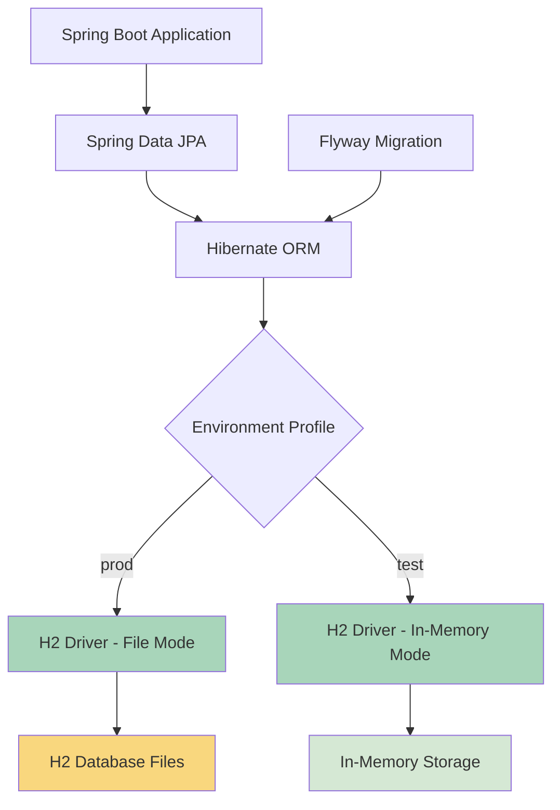

# Design Document: Migrate to H2 Database

## Overview

This design specifies the technical approach for migrating the support ticket management system from PostgreSQL to H2 database across all environments (production, development, and test). The migration eliminates the external database dependency while preserving all existing functionality.

### Design Goals

1. **Zero External Dependencies**: Application runs without requiring PostgreSQL installation or server management
2. **Data Persistence in Production**: File-based H2 storage ensures data survives application restarts
3. **Fast Test Execution**: In-memory H2 for tests maintains existing test performance
4. **Backward Compatibility**: Existing Flyway migrations work without modification
5. **Functional Equivalence**: All features behave identically after migration

### Key Design Decisions

**Decision 1: Use H2 in File Mode for Production**
- Rationale: Provides persistent storage while keeping embedded database benefits
- Alternative Considered: In-memory only (rejected due to data loss on restart)
- Trade-off: File I/O slightly slower than PostgreSQL in production, but eliminates deployment complexity

**Decision 2: Minimal Migration Script Changes**
- Rationale: Existing migrations use SQL compatible with both PostgreSQL and H2
- Alternative Considered: Rewrite migrations (rejected as unnecessary)
- Trade-off: Limited to SQL features common to both databases

**Decision 3: Keep Test Configuration Unchanged**
- Rationale: Tests already use H2 in-memory mode successfully
- Alternative Considered: Use file-based H2 for tests (rejected due to slower execution)
- Trade-off: None - optimal configuration already in place

## Architecture

### Component Overview



### Database Driver Layer

**Before Migration:**
- PostgreSQL JDBC Driver: `org.postgresql.Driver`
- Dialect: `org.hibernate.dialect.PostgreSQLDialect`
- Connection URL Format: `jdbc:postgresql://host:port/database`

**After Migration:**
- H2 JDBC Driver: `org.h2.Driver`
- Dialect: `org.hibernate.dialect.H2Dialect`
- Production URL Format: `jdbc:h2:file:./data/supporttickets`
- Test URL Format: `jdbc:h2:mem:testdb`

### File Storage Structure (Production)

```
project-root/
└── data/
    ├── supporttickets.mv.db    # H2 database file (MVStore format)
    └── supporttickets.trace.db # H2 trace log (if enabled)
```

**Storage Characteristics:**
- MVStore format: H2's modern storage engine with ACID compliance
- Automatic file creation on first startup
- Configurable path via `DB_URL` environment variable
- Default location: `./data/supporttickets` relative to application working directory

## Components and Interfaces

### Maven Dependency Changes

**Dependencies to Remove:**
```xml
<dependency>
    <groupId>org.flywaydb</groupId>
    <artifactId>flyway-database-postgresql</artifactId>
</dependency>

<dependency>
    <groupId>org.postgresql</groupId>
    <artifactId>postgresql</artifactId>
    <scope>runtime</scope>
</dependency>
```

**Dependencies to Add/Modify:**
```xml
<dependency>
    <groupId>com.h2database</groupId>
    <artifactId>h2</artifactId>
    <scope>runtime</scope>  <!-- Changed from test scope -->
</dependency>
```

**Rationale for Scope Change:**
- Previous: H2 only available during test execution
- Updated: H2 available at runtime for production use
- Test scope removed to include H2 in production runtime classpath

### Configuration Changes

#### Production Configuration (`application-prod.properties`)

**Before:**
```properties
spring.datasource.url=${DB_URL}
spring.datasource.username=${DB_USERNAME}
spring.datasource.password=${DB_PASSWORD}
spring.datasource.driver-class-name=org.postgresql.Driver
spring.jpa.database-platform=org.hibernate.dialect.PostgreSQLDialect
```

**After:**
```properties
spring.datasource.url=${DB_URL:jdbc:h2:file:./data/supporttickets}
spring.datasource.username=${DB_USERNAME:sa}
spring.datasource.password=${DB_PASSWORD:}
spring.datasource.driver-class-name=org.h2.Driver
spring.jpa.database-platform=org.hibernate.dialect.H2Dialect
```

**Key Changes:**
1. Driver class: PostgreSQL → H2
2. Dialect: PostgreSQLDialect → H2Dialect
3. Default URL: Provides fallback for local development
4. Default credentials: H2 defaults (sa with empty password)

#### Environment Configuration Template (`.env.example`)

**Before:**
```
# Backend — PostgreSQL connection
DB_URL=jdbc:postgresql://localhost:5432/supporttickets
DB_USERNAME=your_db_username
DB_PASSWORD=your_db_password
```

**After:**
```
# Backend — H2 Database connection
# File-based storage (data persists between restarts)
DB_URL=jdbc:h2:file:./data/supporttickets
DB_USERNAME=sa
DB_PASSWORD=

# Alternative: Absolute path
# DB_URL=jdbc:h2:file:/absolute/path/to/database/supporttickets

# Note: Username and password are optional for H2
# Default credentials (sa with empty password) are used if not specified
```

**Documentation Updates:**
- URL format reflects H2 file-based syntax
- Example shows relative path (most common)
- Comment explains absolute path alternative
- Notes that credentials are optional

#### Test Configuration (No Changes Required)

The existing test configuration already uses H2 correctly:
```properties
spring.datasource.url=jdbc:h2:mem:testdb;DB_CLOSE_DELAY=-1;DB_CLOSE_ON_EXIT=FALSE;MODE=PostgreSQL
spring.datasource.driver-class-name=org.h2.Driver
spring.datasource.username=sa
spring.datasource.password=
spring.jpa.database-platform=org.hibernate.dialect.H2Dialect
```

**Why No Changes:**
- H2 already in test scope (will become runtime scope)
- In-memory mode optimal for test performance
- MODE=PostgreSQL compatibility mode handles Flyway migrations
- All existing tests pass with this configuration

## Data Models

### Schema Compatibility Analysis

The existing Flyway migrations use SQL features that work in both PostgreSQL and H2:

**V1__create_ticket_table.sql Compatibility:**

| Feature | PostgreSQL | H2 | Status |
|---------|-----------|-----|--------|
| BIGSERIAL | Native | AUTO_INCREMENT | ⚠️ Requires translation |
| VARCHAR(n) | Native | Native | ✅ Compatible |
| TEXT | Native | Native | ✅ Compatible |
| TIMESTAMP WITH TIME ZONE | Native | With MODE=PostgreSQL | ✅ Compatible |
| DEFAULT now() | Native | CURRENT_TIMESTAMP | ⚠️ Requires translation |
| INDEX | Native | Native | ✅ Compatible |

**V2__create_comment_table.sql Compatibility:**

| Feature | PostgreSQL | H2 | Status |
|---------|-----------|-----|--------|
| BIGSERIAL | Native | AUTO_INCREMENT | ⚠️ Requires translation |
| REFERENCES | Native | Native | ✅ Compatible |
| ON DELETE CASCADE | Native | Native | ✅ Compatible |
| TIMESTAMP WITH TIME ZONE | Native | With MODE=PostgreSQL | ✅ Compatible |

### Migration Script Modifications Required

**Option 1: Use H2 Compatibility Mode (Recommended)**

Add H2 initialization script to handle PostgreSQL syntax:

Create `backend/src/main/resources/h2-init.sql`:
```sql
-- Enable PostgreSQL compatibility mode
SET MODE PostgreSQL;
```

Update `application-prod.properties`:
```properties
spring.datasource.url=${DB_URL:jdbc:h2:file:./data/supporttickets};MODE=PostgreSQL;DB_CLOSE_DELAY=-1
spring.h2.console.enabled=false
```

**Rationale:** H2's PostgreSQL mode translates BIGSERIAL, now(), and other PostgreSQL-specific syntax automatically.

**Option 2: Rewrite Migrations (Not Recommended)**

Create new migrations compatible with both databases:
- Replace BIGSERIAL with BIGINT + AUTO_INCREMENT
- Replace now() with CURRENT_TIMESTAMP

**Decision:** Use Option 1 (compatibility mode) to avoid rewriting working migrations.

### Data Type Mapping

| PostgreSQL Type | H2 Equivalent | Notes |
|----------------|---------------|-------|
| BIGSERIAL | BIGINT AUTO_INCREMENT | Handled by MODE=PostgreSQL |
| VARCHAR(n) | VARCHAR(n) | Direct mapping |
| TEXT | TEXT | Direct mapping |
| TIMESTAMP WITH TIME ZONE | TIMESTAMP WITH TIME ZONE | Handled by MODE=PostgreSQL |
| TIMESTAMP | TIMESTAMP | Direct mapping |

## Error Handling

### Startup Errors

**Error 1: Database File Not Writable**
- Cause: File path points to read-only location
- Detection: H2 throws exception during connection initialization
- Handling: Application fails to start with clear error message
- User Action: Check DB_URL path permissions

**Error 2: Invalid Database URL**
- Cause: Malformed JDBC URL in DB_URL environment variable
- Detection: Driver manager fails to parse URL
- Handling: Application fails to start with connection error
- User Action: Verify DB_URL format matches `jdbc:h2:file:<path>`

**Error 3: Migration Failure**
- Cause: SQL syntax incompatibility between PostgreSQL and H2
- Detection: Flyway reports migration failure during startup
- Handling: Application fails to start, Flyway logs indicate which migration failed
- User Action: Review migration script for incompatible SQL features

**Error 4: Corrupted Database File**
- Cause: H2 database file corrupted (power loss, disk error)
- Detection: H2 throws exception when opening database file
- Handling: Application fails to start with corruption error
- User Action: Restore from backup or delete database file (data loss)

### Runtime Errors

**Error 5: Disk Space Exhaustion**
- Cause: Database file grows beyond available disk space
- Detection: H2 throws IOException during write operations
- Handling: Exception propagates to service layer, returns 500 Internal Server Error
- User Action: Free disk space or configure different DB_URL path

**Error 6: Concurrent Access Conflict**
- Cause: Multiple application instances accessing same H2 file
- Detection: H2 file locking prevents second instance from opening database
- Handling: Second instance fails to start with lock error
- User Action: Use separate database files per instance or use client-server mode

### Migration Validation

**Pre-Migration Checklist:**
1. Run all existing tests against H2 to verify compatibility
2. Verify Flyway migrations execute successfully against H2
3. Test CRUD operations for tickets and comments
4. Verify timestamp precision and timezone handling
5. Confirm state machine transitions work correctly

**Post-Migration Validation:**
1. Application starts without errors
2. Database files created in expected location
3. Schema version table shows correct migration state
4. All existing integration tests pass
5. Manual smoke test of core features

## Testing Strategy

### Test Approach

This migration is an **Infrastructure as Code** change that does not involve algorithmic logic or data transformation with universal properties. Therefore, **property-based testing is NOT appropriate**.

The testing strategy focuses on:
1. **Integration Testing**: Verify H2 works correctly with the application
2. **Configuration Validation**: Ensure all environments configured properly
3. **Migration Verification**: Confirm Flyway migrations execute successfully
4. **Functional Regression**: Verify all features work identically to PostgreSQL

### Integration Tests

**Test 1: H2 Database Initialization**
- **Purpose**: Verify application starts with H2 and creates database files
- **Approach**: Start application with clean state, verify database files exist
- **Environment**: Production profile with file-based H2
- **Validation**: 
  - Application starts without errors
  - `.mv.db` file created in configured location
  - Flyway migrations applied successfully

**Test 2: Existing Test Suite Compatibility**
- **Purpose**: Verify all existing tests pass with H2 as runtime dependency
- **Approach**: Run full test suite without changes
- **Environment**: Test profile with in-memory H2
- **Validation**: All 20+ existing tests pass (property tests + integration tests)

**Test 3: CRUD Operations Equivalence**
- **Purpose**: Verify ticket and comment operations work identically to PostgreSQL
- **Approach**: Execute existing integration tests against H2
- **Environment**: Test profile
- **Validation**: 
  - `TicketIntegrationTest` passes all scenarios
  - Comment creation and retrieval works correctly
  - Timestamps preserved with correct precision

**Test 4: Flyway Migration Execution**
- **Purpose**: Verify migrations execute successfully against H2
- **Approach**: Use existing `FlywayMigrationTest`
- **Environment**: Test profile
- **Validation**:
  - V1 and V2 migrations apply without errors
  - Schema version table tracks applied migrations
  - All tables and indexes created correctly

**Test 5: State Machine Behavior**
- **Purpose**: Verify ticket status transitions work identically
- **Approach**: Run existing state machine property tests
- **Environment**: Test profile
- **Validation**: `StateMachinePropertyTest` passes all scenarios

### Configuration Tests

**Test 6: Environment Variable Defaults**
- **Purpose**: Verify application uses defaults when environment variables not set
- **Approach**: Start application without DB_URL, DB_USERNAME, DB_PASSWORD
- **Environment**: Production profile
- **Validation**:
  - Application uses `jdbc:h2:file:./data/supporttickets`
  - Application uses username `sa` with empty password
  - Database files created in default location

**Test 7: Custom Database Path**
- **Purpose**: Verify application respects DB_URL environment variable
- **Approach**: Set DB_URL to custom path, start application
- **Environment**: Production profile
- **Validation**:
  - Application creates database at specified path
  - Data persists across restarts

**Test 8: Invalid Configuration Handling**
- **Purpose**: Verify application fails gracefully with invalid configuration
- **Approach**: Provide invalid DB_URL, attempt to start application
- **Environment**: Production profile
- **Validation**:
  - Application fails to start
  - Error message clearly indicates invalid URL

### Regression Tests

**Test 9: All Existing Property Tests**
- **Purpose**: Verify business logic correctness maintained
- **Tests to Run**:
  - `BlankKeywordPropertyTest`
  - `CommentCreationPropertyTest`
  - `ErrorResponseCompletenessPropertyTest`
  - `KeywordSearchPropertyTest`
  - `PriorityValidationPropertyTest`
  - `StatusFilterPropertyTest`
  - `TicketIdUniquenessPropertyTest`
  - `TicketListFieldCompletenessPropertyTest`
  - `TicketListOrderingPropertyTest`
  - `TitleLengthValidationPropertyTest`
  - `PartialUpdatePropertyTest`
  - `StateMachinePropertyTest`
- **Environment**: Test profile
- **Validation**: All tests pass without modification

### Manual Testing

**Test 10: Smoke Test After Deployment**
- **Purpose**: Verify application works end-to-end in production configuration
- **Approach**: Manual verification of core workflows
- **Environment**: Production profile (local or deployed)
- **Steps**:
  1. Start application from clean state
  2. Create a ticket via REST API
  3. Add a comment to the ticket
  4. Update ticket status
  5. Search for tickets by keyword
  6. Restart application
  7. Verify data persists (ticket and comment still exist)
- **Validation**: All operations succeed, data persists

### Test Execution Order

1. **Unit and Property Tests** (unchanged, should all pass)
2. **Integration Tests** (verify H2 compatibility)
3. **Configuration Tests** (verify environment variables)
4. **Manual Smoke Test** (verify end-to-end functionality)

### Expected Results

- **All existing tests pass**: No test failures introduced by migration
- **Zero code changes required**: Only configuration and dependencies change
- **Flyway migrations succeed**: No rewriting of migration scripts needed
- **Data persistence verified**: Production data survives restarts

## Implementation Plan

### Phase 1: Dependency Updates

1. Update `pom.xml`:
   - Remove `flyway-database-postgresql` dependency
   - Remove `postgresql` dependency
   - Change H2 dependency scope from `test` to `runtime`

2. Verify build:
   ```bash
   mvn clean compile
   ```

### Phase 2: Configuration Updates

1. Update `application-prod.properties`:
   - Change driver class to `org.h2.Driver`
   - Change dialect to `org.hibernate.dialect.H2Dialect`
   - Update datasource URL with default value and MODE=PostgreSQL

2. Update `.env.example`:
   - Replace PostgreSQL example with H2 example
   - Document H2 URL format
   - Update comments to reflect H2 configuration

3. Verify test configuration unchanged:
   - Confirm `application-test.properties` already uses H2
   - No changes needed

### Phase 3: Migration Compatibility

1. Test Flyway migrations:
   ```bash
   mvn test -Dtest=FlywayMigrationTest
   ```

2. If migrations fail:
   - Add MODE=PostgreSQL to datasource URL
   - Retest migrations

3. Verify no syntax errors in V1 and V2 migration files

### Phase 4: Testing

1. Run all existing tests:
   ```bash
   mvn clean test
   ```

2. Verify all tests pass (expected: 100% pass rate)

3. Run application locally with production profile:
   ```bash
   mvn spring-boot:run -Dspring-boot.run.profiles=prod
   ```

4. Perform manual smoke test (create ticket, add comment, restart, verify persistence)

### Phase 5: Documentation

1. Update README.md (if exists):
   - Remove PostgreSQL setup instructions
   - Document H2 file location
   - Update getting started guide

2. Update deployment documentation:
   - Remove PostgreSQL requirements
   - Document DB_URL configuration
   - Note data backup recommendations

### Rollback Plan

If issues discovered after migration:

1. **Immediate Rollback**:
   - Revert `pom.xml` changes
   - Restore original `application-prod.properties`
   - Restore original `.env.example`
   - Redeploy with PostgreSQL

2. **Data Migration** (if needed):
   - Export data from H2 using SQL dump
   - Import into PostgreSQL
   - Verify data integrity

## Deployment Considerations

### Production Deployment

**First-Time Deployment:**
1. Application creates database files automatically
2. Flyway runs migrations on first startup
3. No manual database setup required

**Existing Deployment (PostgreSQL to H2):**
1. Export existing PostgreSQL data (SQL dump)
2. Deploy application with H2 configuration
3. Import data into H2 (if data migration required)
4. Verify data integrity

**Environment Variables:**
- Set `DB_URL` if custom path needed (optional)
- Set `DB_USERNAME` and `DB_PASSWORD` if custom credentials needed (optional)
- Use defaults for simplest deployment

### Data Backup Recommendations

**Backup Strategy:**
1. Periodic file system backups of `data/` directory
2. SQL dumps for point-in-time recovery
3. Consider external backup service for production

**Backup Command (SQL dump):**
```bash
# Requires H2 console or external tool
# Recommended: File system backup of .mv.db file
```

**Restore Process:**
1. Stop application
2. Replace `.mv.db` file with backup
3. Start application
4. Verify data integrity

### Scaling Considerations

**Single Instance:**
- File-based H2 works well
- Data persists across restarts
- No external database management

**Multiple Instances:**
- H2 file locking prevents concurrent access
- Options:
  1. Use separate database file per instance
  2. Use H2 in server mode (adds complexity)
  3. Consider reverting to PostgreSQL for true multi-instance

**Recommendation:** This migration optimizes for single-instance deployments. Multi-instance deployments should use PostgreSQL or an alternative client-server database.

## Security Considerations

### Credential Management

**Default Credentials:**
- Username: `sa`
- Password: (empty)
- Risk: Low for embedded file-based database
- Mitigation: File system permissions control access

**Custom Credentials:**
- Can set DB_USERNAME and DB_PASSWORD via environment variables
- H2 supports password encryption
- Recommendation: Use file system permissions as primary security

### File System Security

**Database File Permissions:**
- Restrict read/write to application user only
- Prevent unauthorized access via file system
- Example: `chmod 600 data/supporttickets.mv.db`

**Data Directory:**
- Should not be in web-accessible location
- Should be excluded from version control (.gitignore)
- Should be backed up regularly

### Network Security

**H2 Console:**
- Disabled in production (`spring.h2.console.enabled=false`)
- Should only be enabled for development/debugging
- Provides web interface to database if enabled

**TCP Server Mode:**
- Not enabled in this design
- If needed, requires additional security (authentication, encryption)
- Out of scope for embedded deployment

## Performance Considerations

### Expected Performance Characteristics

**Read Operations:**
- H2 in-memory: Faster than PostgreSQL
- H2 file-based: Comparable to PostgreSQL for small datasets
- Indexes supported (existing indexes preserved)

**Write Operations:**
- H2 file-based: May be slower than PostgreSQL for high-volume writes
- ACID compliance maintained
- Transaction support unchanged

**Database Size:**
- Expected: Small to medium (< 1GB)
- H2 performs well in this range
- MVStore format efficient for embedded use

### Optimization Settings

**Recommended H2 URL Parameters:**
```
jdbc:h2:file:./data/supporttickets;MODE=PostgreSQL;DB_CLOSE_DELAY=-1;AUTO_SERVER=FALSE
```

**Parameter Explanations:**
- `MODE=PostgreSQL`: Syntax compatibility
- `DB_CLOSE_DELAY=-1`: Keep database open while JVM running
- `AUTO_SERVER=FALSE`: Disable automatic server mode (single instance)

## Migration Verification Checklist

Before considering migration complete:

- [ ] `pom.xml` updated (PostgreSQL removed, H2 scope changed)
- [ ] `application-prod.properties` updated (driver, dialect, URL)
- [ ] `.env.example` updated (H2 examples and documentation)
- [ ] All existing tests pass (`mvn test`)
- [ ] FlywayMigrationTest passes
- [ ] Application starts with production profile
- [ ] Database files created in expected location
- [ ] Ticket creation works via API
- [ ] Comment creation works via API
- [ ] Data persists across application restart
- [ ] All property-based tests pass
- [ ] Integration tests pass
- [ ] Manual smoke test completed successfully

## Conclusion

This design provides a straightforward path to migrate from PostgreSQL to H2 while preserving all existing functionality. The use of H2's PostgreSQL compatibility mode eliminates the need to rewrite Flyway migrations, and the minimal configuration changes reduce risk.

The migration is appropriate for single-instance deployments where simplified operations outweigh the performance characteristics of a client-server database. For multi-instance or high-volume deployments, PostgreSQL remains the better choice.
